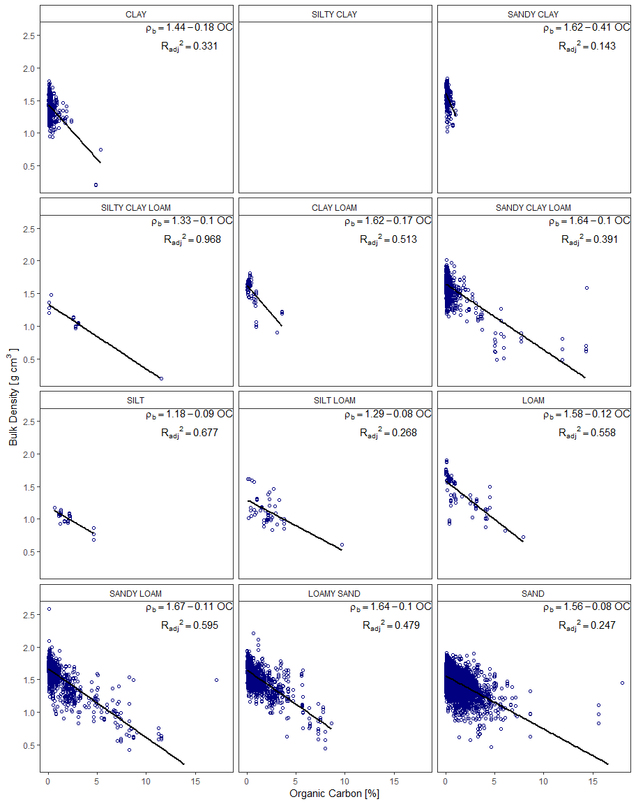
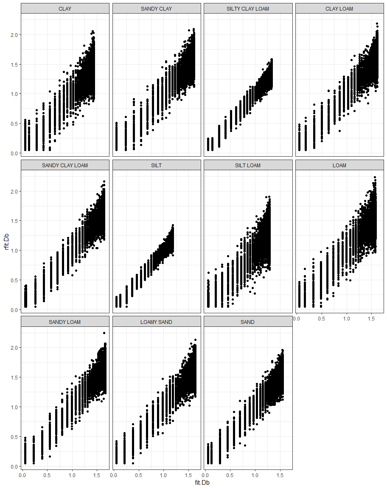
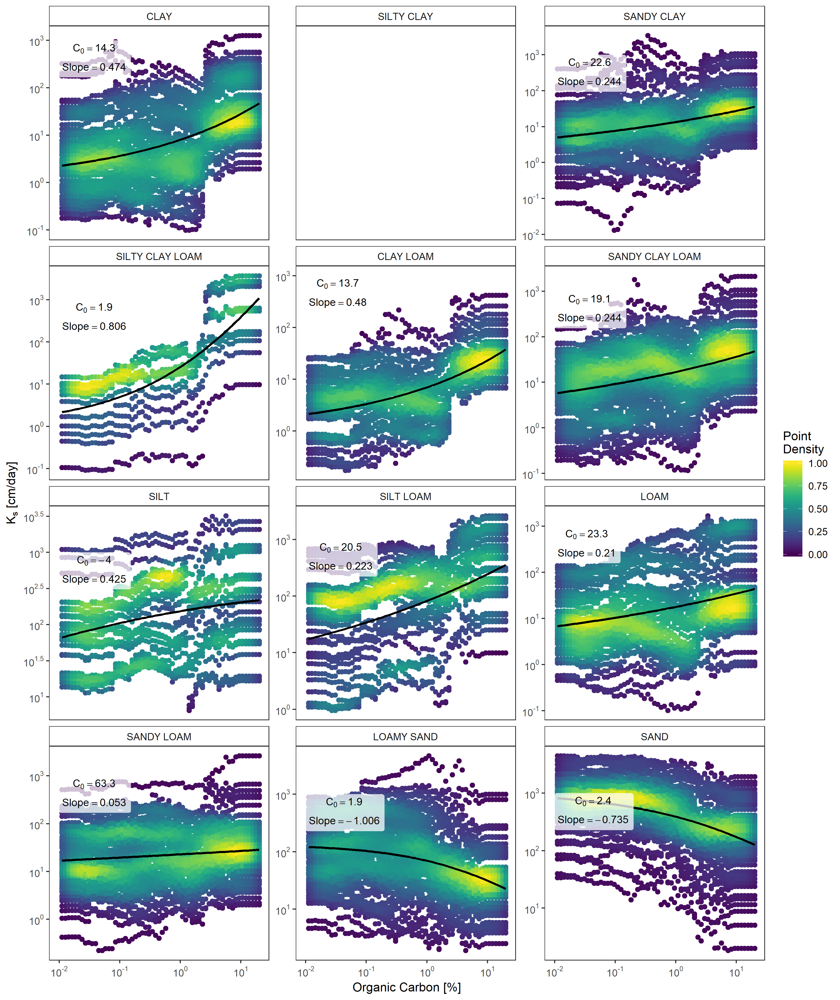
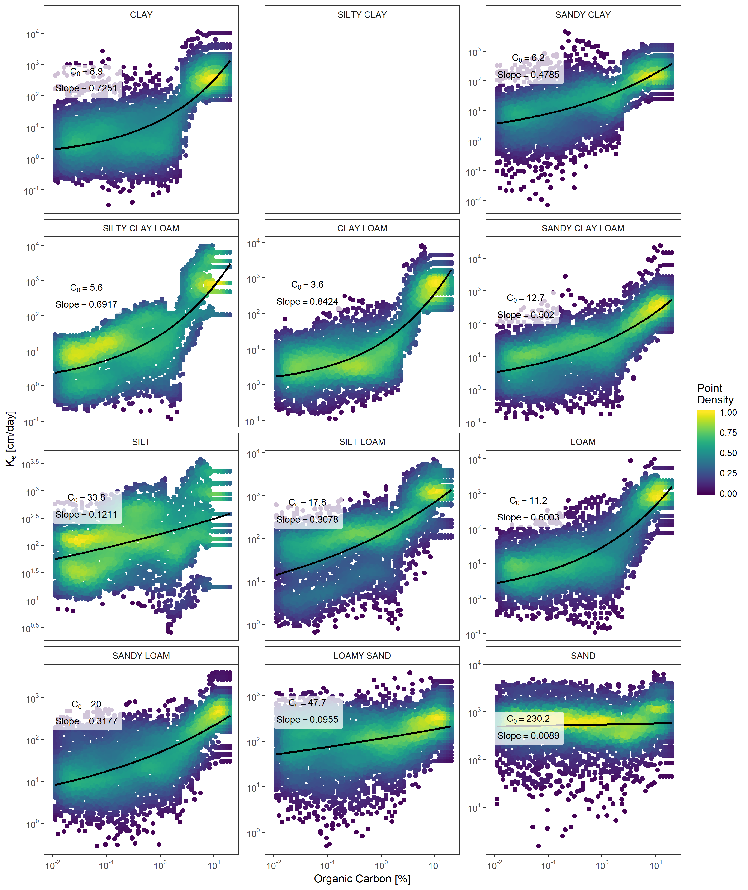
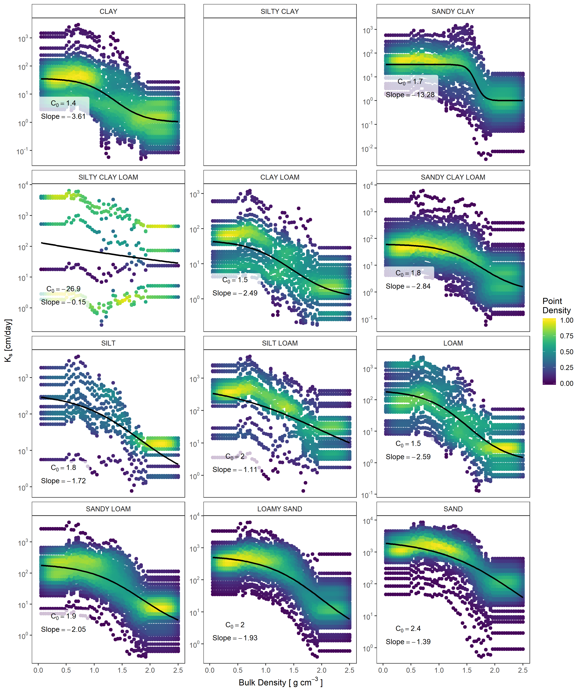
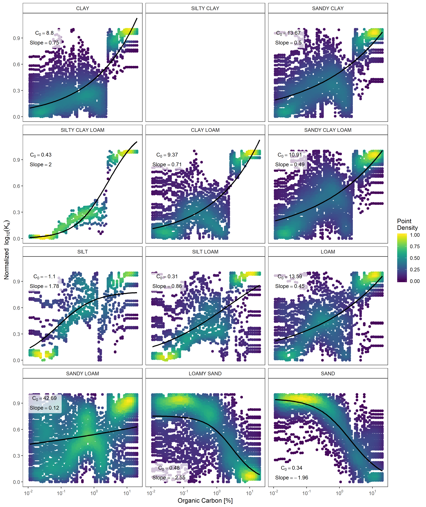
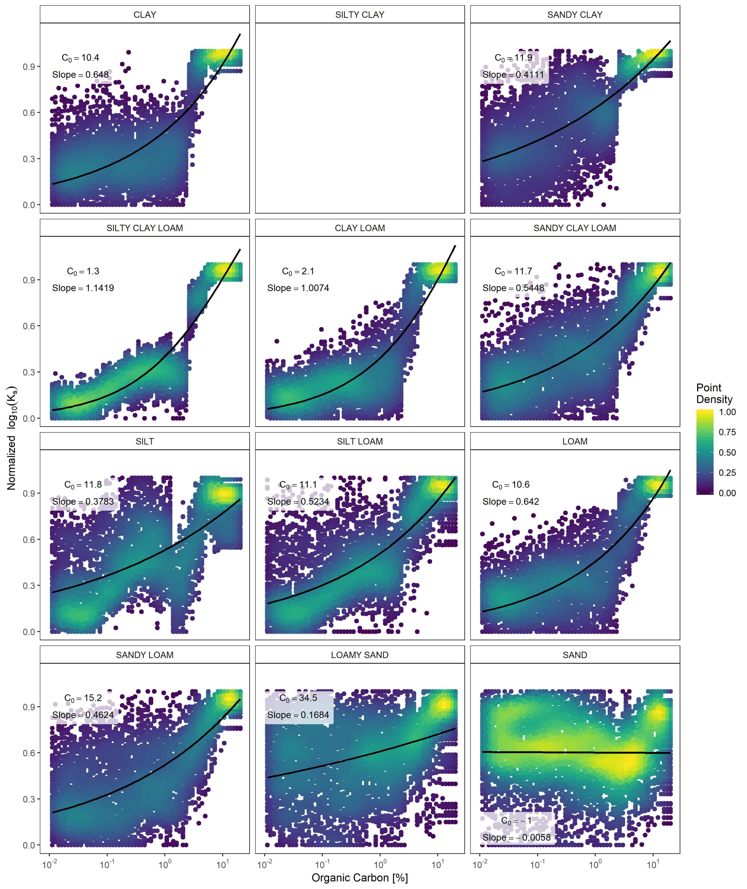
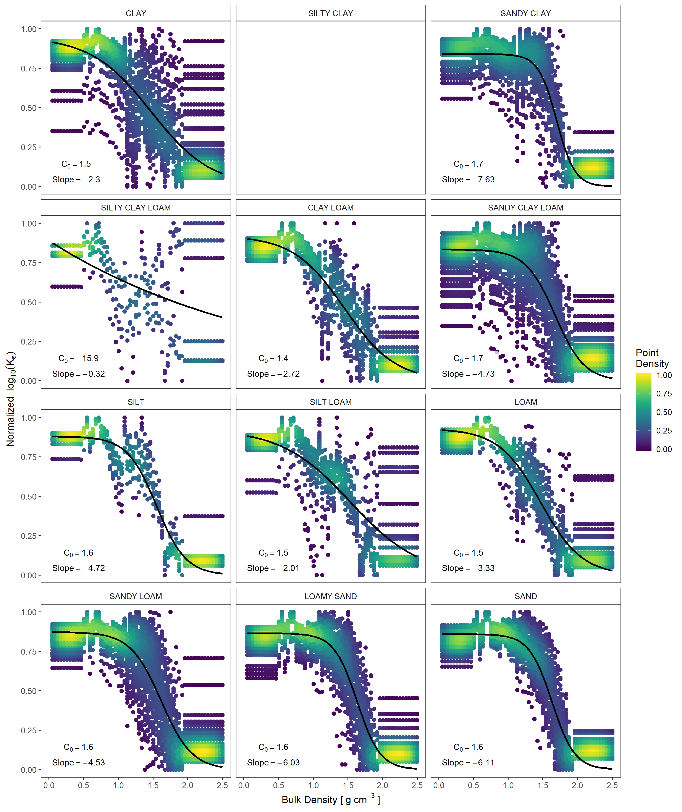

# Partial Effect Analysis

This script analyzes the partial dependency of $$K_s$$ on bulk density and organic carbon.

We explore functional forms of relationships between soil structural properties
and $K_S$ using a form of partial dependence values.

Steps:

1. Randomly sample, with replacement, n soils from each textural class.
2. Copy rows x times and add perturbed BD and logOC: linearly increment both as seq(min, max, length.out= 60).
3. Fit linear model between BD and OC.
4. Add OC fitted BD column: fit.BD = m(OC) + b
5. Add OC fitted BD column perturbed with normal distribution of variance: rfit.BD = rnorm(1, mean = fit.BD, var = sqrt(SD.BD)).
6. Predict Ks with perturbed OC and BD as: log10Ks_OC, log10Ks_OCBD, log10Ks_BD.
7. Fit logistic curves to log10Ks_OC ~ log10OC, log10Ks_OCBD ~ log10OC, and log10Ks_BD ~ BD as: fit.log10Ks_OC, fit.log10Ks_OCBD, and fit.log10Ks_BD.
8. Plot points and fit lines.


## 1. Resample soils

Staratified random samples with replacement from each soil textural class.
Replacement since some textural classes don't have n soils,


## 2. Make copies of resamples soils with perturbed BD and logOC
Create table where each soil repeates 60 times accross bulk density
and logOC with linear incremental changes of both as `seq(min, max, length.out= 60)`.


```r
# Create a unique ID
sub.usksat.dt <- sub.usksat.dt%>%
  mutate(SoilID2 = paste(rTexclass, SoilID, sep="_"))
# Cross join bulk density sequence to soil id (faster than expand.grid())
bseq.dt = data.table::CJ(SoilID2 = sub.usksat.dt$SoilID2, Db.seq= seq(0.05,2.5, length.out = 60), sorted = FALSE)
cseq.dt = data.table::CJ(SoilID2 = sub.usksat.dt$SoilID2, logOC.seq = seq(-4.5,3, length.out = 60), sorted = FALSE)
seq.dt = cbind(bseq.dt, cseq.dt[,2])
seq.dt = merge(seq.dt, sub.usksat.dt, by="SoilID2", sort = FALSE)
rm(cseq.dt, bseq.dt)
```

## 1. Fit linear model between BD and OC of USKSAT data


```r
## Fit linear model by texture
bd.cor.dt <- usksat.dt%>%
  group_by(rTexclass)%>%
  do(fitBD = lm(Db ~ OC, data = .))

# get the fit coefficients by texture group in a tidy data_frame
bd.coef.dt <- tidy(bd.cor.dt, fitBD)
# get the summary statistics by group in a tidy data_frame
bd.summ.dt = glance(bd.cor.dt, fitBD)
# reshape coeficient table and add a model equation column.
bd.coef.dt2 <- bd.coef.dt%>%
  gather(key = "Var", value = "Val", -rTexclass, -term)%>%
  spread(key = term, value = Val)%>%
  filter(Var == "estimate")%>%
  group_by(rTexclass)%>%
  mutate(model = paste0("rho[b] == ", round(`(Intercept)`,2),
                        round(OC,2), "~OC") )
# Merge coeficent table with fit summary table
bd.summ.dt = left_join(bd.summ.dt, bd.coef.dt2)
```

```
## Joining, by = "rTexclass"
```

```r
## Plot BD ~ OC
# Add blank row for silt clay texture
p.dt = data.frame(usksat.dt)
p.dt[nrow(p.dt)+1,] <- NA
p.dt$rTexclass[nrow(p.dt)] <- as.factor("SILTY CLAY")
```

```r
bd.cor.p <- ggplot(p.dt)+
  geom_point(aes(y = Db, x = OC), shape = 1, color = "navyblue")+
  geom_smooth(aes(y = Db, x = OC), na.rm = TRUE,
              method = "lm", se = FALSE, color = "black")+
  geom_text(data = bd.summ.dt ,aes(x = Inf, y = Inf,
                                   label = paste("atop(", model,",",
                                                 "{R[adj]}^2 ==", format(adj.r.squared, digits = 3),")" ) ),
            vjust = "inward", hjust = "inward", parse = T) +
  labs(x = "Organic Carbon [%]",
       y = bquote("Bulk Density ["~g~cm^3~"]" ) )+
  facet_wrap(~rTexclass, ncol = 3)+
  scale_x_continuous(limits = c(0, NA), breaks = scales::pretty_breaks(n = 5))+
  scale_y_continuous(limits = c(0.2, NA),breaks = scales::pretty_breaks(n = 5)) +
  theme_bw()+
  theme(panel.grid = element_blank(),
        strip.background = element_rect( fill="white"))
bd.cor.p
```

```
## Warning: Removed 12 rows containing missing values (geom_point).
```

<!-- -->

## 4. Add OC fitted BD columns

 1. Bulk density fitted to OC: $fit.BD = m(OC) + b$
 2. Bulk density fitted to OC and perturbed with random 'error' from within the
 normal distribution of the fit variance $rfit.BD = rnorm(1, mean = fit.BD, var = sigma)$.


```r
# Append BD~OC fit summary data to seq data.
bd.summ.dt = dplyr::rename(bd.summ.dt, "OC.m" = OC)
#names(bd.summ.dt)[which(names(bd.summ.dt)=="OC")] = "OC.m"
seq.dt <- left_join(seq.dt, bd.summ.dt, by = "rTexclass")
# Append fit and perturbed fit columns, Force BD > 0.05.
seq.dt <- seq.dt%>%
  mutate(fit.Db = `(Intercept)` + OC.m * exp(logOC.seq),
         fit.Db = ifelse(fit.Db >0.05, fit.Db, 0.05),
         rfit.Db = rnorm(n = n(), mean = fit.Db, sigma),
         rfit.Db = ifelse(rfit.Db > 0.05, rfit.Db, 0.05))

# Visualize and compare the two BD fits.
```

```r
rp = ggplot(seq.dt, aes(x = fit.Db, y = rfit.Db)) +
  geom_point()+
  facet_wrap(~rTexclass)+
  theme_bw()
rp
```

<!-- -->

## 5. Predict Ks with perturbed OC and BD
Predict: log10Ks_OC, log10Ks_OCBD, log10Ks_BD.


```r
## Function to predict from table with selected BD and logOC

pred_custom <- function(dt.table, BD.name = NA, logOC.name = NA,
                        prepro_model = usksat.pre,
                        ptf_model = gbmModelTune){

  # Remove default columns and rename selected BD and OC columns
  if (!is.na(logOC.name)){
    dt.table = dt.table%>%
      dplyr::select(-logOC)%>%
      dplyr::rename("logOC" = logOC.name)
  }
  if (!is.na(BD.name)){
    dt.table = dt.table%>%
      dplyr::select(-Db)%>%
      dplyr::rename("Db" = BD.name)
  }

  prepro_cols <- prepro_model$method$scale # all Column names for centering and scaling
  model_cols <- predictors(ptf_model) # column names for predictor input

  # Preprocess predictors
  dt = subset(dt.table,select = prepro_cols)
  dt = predict(prepro_model, dt)
  # Run PTF
  dt <- subset(dt, select = model_cols)
  pred_logKs = predict(ptf_model, newdata = dt)
  return(pred_logKs)
}

# Merge predicted column
logKs_OC = pred_custom(dt.table = seq.dt, logOC.name = "logOC.seq")
seq.dt = cbind(seq.dt, logKs_OC)
#
logKs_OCBD = pred_custom(dt.table = seq.dt, logOC.name = "rfit.Db")
seq.dt = cbind(seq.dt, logKs_OCBD)
#
logKs_BD = pred_custom(dt.table = seq.dt, logOC.name = "Db.seq")
seq.dt = cbind(seq.dt, logKs_BD)
```

## 6. Fit logistic curves to Ks ~ perturbation.
Fit s-curve as:

* $sfit.log10Ks_OC = log10Ks_OC ~ log10OC$,
* $sfit.log10Ks_OCBD = log10Ks_OCBD ~ log10OC$, and
* $sfit.log10Ks_BD = log10Ks_BD ~ BD$


```r
# Convert Ks units to log10(cm/day)
seq.dt = seq.dt%>%
  mutate(log10Ks_OC = log10(exp(logKs_OC)*24),
         log10Ks_OCBD = log10(exp(logKs_OCBD)*24),
         log10Ks_BD = log10(exp(logKs_BD)*24),
         log10Ks = log10(Ksat_cmhr*24) )


seq.dt = seq.dt%>%
  group_by(rTexclass, SoilID)%>%
  mutate(norm_log10Ks_OC = scales::rescale(log10Ks_OC),
         norm_log10Ks_OCBD = scales::rescale(log10Ks_OCBD),
         norm_log10Ks_BD = scales::rescale(log10Ks_BD) )
```

S-curve function
$$ y = \frac{L}{1+e^{-k(x-x_0)}} $$


```r
logisticFun = function(L, k, x0,x){
  y = L/(1+exp(-k*(x-x0)))
  return(y)
}
# Function to run S-curve fitting
get.fitcoef <- function(Ksat.i,seq.i){
  sFit <- nlsLM(formula = Ksat.i~logisticFun(L,k,x0,seq.i),
                data = data.frame(Ksat.i = Ksat.i, seq.i = seq.i),
                start = list(L = 5, k = -10, x0 = 0),
                alg = "plinear", control = list(maxiter = 5000) )

  sfit.coef <- data.table(t(coef(sFit)))
  rmse <- data.table(mean(residuals(sFit)^2))
  sfit.ceof <- cbind(sfit.coef,  rmse)
  return(sfit.coef)

}

sfit_cols <- c("varL", "vark", "varx0",
               "rmse")
```

### Fit logistic curve to $Log_{10}(K_s)$


```r
seq.dt <- data.table(seq.dt)
log10OC_sfit_cols <- paste0("log10OC_", sfit_cols)
seq.dt <- seq.dt[, (log10OC_sfit_cols) := get.fitcoef(log10Ks_OC, log10(exp(logOC.seq))), by = rTexclass]
```

```r
#
log10OCBD_sfit_cols <- paste0("log10OC_BD", sfit_cols)
seq.dt <- seq.dt[, (log10OCBD_sfit_cols) := get.fitcoef(log10Ks_OCBD, log10(exp(logOC.seq))), by = rTexclass]
```


```r
#
BD_sfit_cols <- paste0("BD_", sfit_cols)
seq.dt <- seq.dt[, (BD_sfit_cols) := get.fitcoef(log10Ks_BD, Db.seq), by = rTexclass]
```

```r
## Predict with s-fit for plotting purpuses
seq.dt <- seq.dt[, sfit_log10Ks_OC := logisticFun(log10OC_varL,log10OC_vark, log10OC_varx0, log10(exp(logOC.seq)))]
#
seq.dt <- seq.dt[, sfit_log10Ks_OCBD := logisticFun(log10OC_BDvarL,log10OC_BDvark, log10OC_BDvarx0, log10(exp(logOC.seq)))]
#
seq.dt <- seq.dt[, sfit_log10Ks_BD := logisticFun(BD_varL,BD_vark, BD_varx0, Db.seq)]
```

### Fit logistic curve to normalized $Log_{10}(K_s)$


```r
norm_log10OC_sfit_cols <- paste0("norm_log10OC_", sfit_cols)
seq.dt <- seq.dt[, (norm_log10OC_sfit_cols) := get.fitcoef(norm_log10Ks_OC, log10(exp(logOC.seq))), by = rTexclass]
```


```r
#
norm_log10OCBD_sfit_cols <- paste0("norm_log10OC_BD", sfit_cols)
seq.dt <- seq.dt[, (norm_log10OCBD_sfit_cols) := get.fitcoef(norm_log10Ks_OCBD, log10(exp(logOC.seq))), by = rTexclass]
```


```r
#
norm_BD_sfit_cols <- paste0("norm_BD_", sfit_cols)
seq.dt <- seq.dt[, (norm_BD_sfit_cols) := get.fitcoef(norm_log10Ks_BD, Db.seq), by = rTexclass]
```


```r
## Predict with s-fit for plotting purpuses
seq.dt <- seq.dt[, norm_sfit_log10Ks_OC := logisticFun(norm_log10OC_varL,norm_log10OC_vark, norm_log10OC_varx0, log10(exp(logOC.seq)))]
#
seq.dt <- seq.dt[, norm_sfit_log10Ks_OCBD := logisticFun(norm_log10OC_BDvarL,norm_log10OC_BDvark, norm_log10OC_BDvarx0, log10(exp(logOC.seq)))]
#
seq.dt <- seq.dt[, norm_sfit_log10Ks_BD := logisticFun(norm_BD_varL,norm_BD_vark, norm_BD_varx0, Db.seq)]

#
### Table of fit variables
sfit.seq.dt <- seq.dt%>%
  dplyr::select(rTexclass, log10OC_varL:BD_rmse, norm_log10OC_varL:norm_BD_rmse)%>%
  group_by(rTexclass)%>%
  summarize_all(funs(mean, sd))
```

7. Plot partial dependency plots


```r
seq.dt = na.omit(seq.dt)
# Calculate point density
get_density <- function(x, y, n = 100) {
  ## Function to get density of points in 2 dimensions.
  ##
  ##Parameters:
  #   x: A numeric vector.
  #   y: A numeric vector.
  #   n: Create a square n by n grid to compute density.
  ##
  ## @return The density within each square.
  dens <- MASS::kde2d(x = x, y = y, n = n)
  ix <- findInterval(x, dens$x)
  iy <- findInterval(y, dens$y)
  ii <- cbind(ix, iy)
  return(dens$z[ii])
}
#
seq.dt = seq.dt%>%
  group_by(rTexclass)%>%
  mutate(d_fit_OC = get_density(log10Ks_OC, log10(exp(logOC.seq))),
         d_fit_OCBD = get_density(log10Ks_OCBD, log10(exp(logOC.seq))),
         d_fit_BD = get_density(log10Ks_BD, Db.seq),
         d_fit_OC = scales::rescale(d_fit_OC),
         d_fit_OCBD = scales::rescale(d_fit_OCBD),
         d_fit_BD = scales::rescale(d_fit_BD),
         #
         n_d_fit_OC = get_density(norm_log10Ks_OC, log10(exp(logOC.seq))),
         n_d_fit_OCBD = get_density(norm_log10Ks_OCBD, log10(exp(logOC.seq))),
         n_d_fit_BD = get_density(norm_log10Ks_BD, Db.seq),
         n_d_fit_OC = scales::rescale(n_d_fit_OC),
         n_d_fit_OCBD = scales::rescale(n_d_fit_OCBD),
         n_d_fit_BD = scales::rescale(n_d_fit_BD))

## ranges for s curve fit labels:
sfit.seq.dt <- sfit.seq.dt%>%
  mutate(min_log10OC_vark_mean = (log10OC_vark_mean/abs(log10OC_vark_mean)) )


seq.dt <-  data.frame(seq.dt)
seq.dt[nrow(seq.dt)+1,] <- NA
seq.dt$rTexclass[nrow(seq.dt)] <- as.factor("SILTY CLAY")

seq.dt = data.table(seq.dt)
```

### Plot of Ks change over OC

<!-- -->

###  Plot of Ks change over OC and BD f(OC) change

<!-- -->

###  Plot of Ks change over DB

<!-- -->

### Normalized plot of Ks change over OC

<!-- -->

###  Normalized plot of Ks change over OC and BD f(OC) change

<!-- -->

###  Normalized plot of Ks change over DB


<!-- -->


---
title: "Structure_Partial_Effect.R"
author: "saray"
date: "Fri Feb 15 16:04:16 2019"
---
