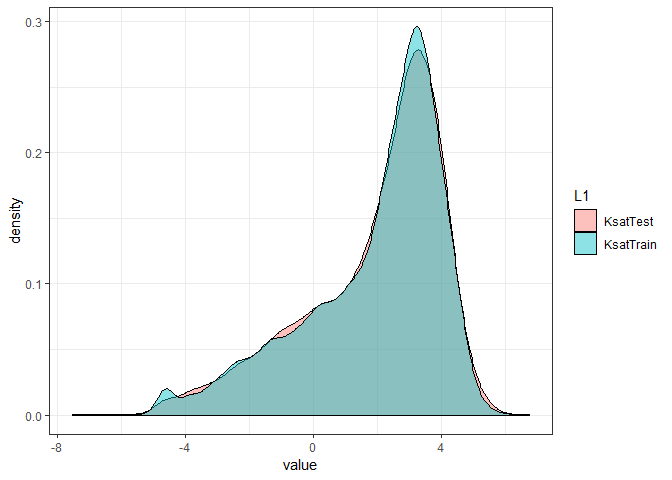

# USKSAT Tidying Up, Pre-Processing and Data Splitting

Load the required libraries and files


```r
# libraries
library(knitr)
library(tidyverse)
library(magrittr)
library(data.table)
library(ggpubr)
```


```r
library(caret)
library(mlr)
# Set Directories
wDir <- getwd()
dataDir <- file.path(wDir, "Data")
funDir <- file.path(wDir, "Functions")
# texture related functions
source(file = file.path(funDir,"Functions_TextureRelated.R"))
# Import table
dt = read.csv(file = file.path(dataDir,"USKsat_OpenRefined.csv"), na.strings = c("","NA"), stringsAsFactors = F )
```

## Tidy Up Textural Size Classes
Check if textural classes add up to 100.


```r
dt = dt%>%
  mutate(sum.Sand = round(VCOS+ COS+ MS+ FS+ VFS,1),
         diff.Sand = round(100 - Clay - Silt,1),
         sum.vs.Sand = round(sum.Sand - Sand,1),
         diff.vs.Sand = round(diff.Sand - Sand, 1),
         diff.vs.sum.Sand = round(sum.Sand - diff.Sand,1)
  )
```

Count of rows with no texture size fraction data vs no sub-sand size data vs
(False = data is present)


```r
plyr::count(is.na(dt[, c("diff.Sand", "sum.Sand")]))
```

```
##   x.diff.Sand x.sum.Sand  freq
## 1       FALSE      FALSE 19656
## 2       FALSE       TRUE   573
## 3        TRUE      FALSE     2
## 4        TRUE       TRUE   620
```

### Fix Textural size classes
Use protocol from `FixTexFractions` function to handle irregularity


```r
dt.tex = data.table(dt)
dt.tex[, c("rVCOS","rCOS","rMS","rFS","rVFS","rSand","rSilt","rClay")
       := FixTexFractions(VCOS, COS, MS, FS, VFS, Sand, Silt, Clay, b=5),
       by = 1:nrow(dt.tex)]
```

check if there were rows with condition outside of FixTexFractions function.


```r
which(dt.tex$rClay ==9999)
```

```
## integer(0)
```

Check if new textural sizes add up to 100 (with b margin of error).


```r
dt.tex = dt.tex%>%
  mutate(rsum.Sand = round(rVCOS+ rCOS+ rMS+ rFS+ rVFS,1),
         rdiff.Sand = round(100 - rClay - rSilt,1),
         rsum.vs.Sand = round(rsum.Sand - rSand,1),
         rdiff.vs.Sand = round(rdiff.Sand - rSand, 1),
         rdiff.vs.sum.Sand = round(rsum.Sand - rdiff.Sand,1)
  )

range(dt.tex$rsum.vs.Sand, na.rm = T)
```

```
## [1] -3.9  4.5
```

```r
range(dt.tex$rdiff.vs.sum.Sand, na.rm = T)
```

```
## [1] -4.8  4.5
```

Summarize data: 3-texture, 7-texture, Db and OC


```r
mlr::summarizeColumns(dt.tex[, c("Ksat_cmhr","rdiff.Sand", "rsum.Sand", "Db", "OC")])
```

```
##         name    type   na      mean        disp median       mad
## 1  Ksat_cmhr numeric    0 24.895953 117.4995910  11.80 16.708902
## 2 rdiff.Sand numeric  702 83.336702  19.2823756  91.50  8.895600
## 3  rsum.Sand numeric 1290 84.420009  17.9387869  91.80  8.302560
## 4         Db numeric  276  1.506248   0.2303731   1.54  0.133434
## 5         OC numeric 1686  1.156637   4.8848593   0.22  0.237216
##             min      max nlevs
## 1  2.219742e-05 9221.198     0
## 2 -1.000000e-01   99.900     0
## 3  1.000000e-01  102.500     0
## 4  1.165525e-02    2.580     0
## 5  0.000000e+00   59.200     0
```

```r
#
```

Count of rows in with no texture size data or no sub-sand size data
 in the corrected vs original data(False = data is present)


```r
plyr::count(is.na(dt.tex[, c("rdiff.Sand", "diff.Sand")]))
```

```
##   x.rdiff.Sand x.diff.Sand  freq
## 1        FALSE       FALSE 20149
## 2         TRUE       FALSE    80
## 3         TRUE        TRUE   622
```

```r
plyr::count(is.na(dt.tex[, c("rsum.Sand", "sum.Sand")]))
```

```
##   x.rsum.Sand x.sum.Sand  freq
## 1       FALSE      FALSE 19561
## 2        TRUE      FALSE    97
## 3        TRUE       TRUE  1193
```

Subset rows without new textural size data


```r
dt.tex2 = subset(dt.tex, !is.na(rdiff.Sand))
```

Count of rows with no bulk density data, with no OC data or no 7-texture size classes
(False = data is present)


```r
plyr::count(is.na(dt.tex2[, c("rsum.Sand","Db", "OC")]))
```

```
##   x.rsum.Sand  x.Db  x.OC  freq
## 1       FALSE FALSE FALSE 18709
## 2       FALSE FALSE  TRUE   816
## 3       FALSE  TRUE FALSE    22
## 4       FALSE  TRUE  TRUE    14
## 5        TRUE FALSE FALSE    75
## 6        TRUE FALSE  TRUE   494
## 7        TRUE  TRUE  TRUE    19
```

Size of data subset with different missing variables


```r
dt.tex2 %>%
  summarise(total.count=n(),
            no.SubTex=sum(is.na(rsum.Sand)),
            no.Db=sum(is.na(Db)),
            no.OC=sum(is.na(OC)),
            count.SubtexOCDB = sum(!is.na(rsum.Sand & Db & OC)),
            count.SubtexDB = sum(!is.na(rsum.Sand & Db)),
            count.OCDB = sum(!is.na(Db & OC)),
            countDB = sum(!is.na(Db )),
            count.Subtex = sum(!is.na(rsum.Sand)),
            count.tex = sum(!is.na(rdiff.Sand))
  )
```

```
##   total.count no.SubTex no.Db no.OC count.SubtexOCDB count.SubtexDB
## 1       20149       588    55  1343            18709          19525
##   count.OCDB countDB count.Subtex count.tex
## 1      18784   20094        19561     20149
```

rename tabel to do More manipulations


```r
dt = dt.tex2
```

### Assign textural class


```r
dt = data.table(dt)
dt[, "rTexclass"
   := AssignTexClass(rSand, rClay),
   by = 1:nrow(dt)]
```

Make textrue ordered factor


```r
dt$rTexclass = factor(dt$rTexclass, levels = c("CLAY", "SILTY CLAY","SANDY CLAY",
                                               "SILTY CLAY LOAM", "CLAY LOAM","SANDY CLAY LOAM",
                                               "SILT", "SILT LOAM","LOAM",
                                               "SANDY LOAM", "LOAMY SAND","SAND") )
```

## Calculate percentile particle sizes
Calculate the 10th, 50th and 60th percentile particle sizes
and coefficient of uniformity (as d60/d10).


```r
dt[,c("d10" ,"d50", "d60", "CU")
   := CalculatePercentileSize(rClay,rSilt,rVCOS,rCOS,rMS,rFS,rVFS),
   by = 1:nrow(dt)]
```

Calculate percentilee sizesfrom only sand and silt clay


```r
dt[,c("d10_2" ,"d50_2", "d60_2", "CU_2")
   := CalculatePercentileSize_Coarse(rClay,rSilt),
   by = 1:nrow(dt)]
```

## Calculate Complexed Organic Carbon
COC variable (Dexter et al. 2008)
$$ COC = IF [OC < \frac{Cl}{n}] THEN[OC] ELSE [\frac{Cl}{n}] $$

Where 'n' is the fraction of clay that complexes 1g of organic carbon
We use a value of n = 10 similar to Dexter et al. (2008)


```r
dt[,"COC"
   := CalculateCOC(rClay, OC),
   by = 1:nrow(dt)]
```

## Log transform variables to make distribution more normal


```r
#
dt = dt %>%
  mutate(logOC = ifelse(OC == 0, log(0.001), log(OC)),
         log10OC = ifelse(OC == 0, log10(0.001), log10(OC)),
         log.Ksat = log(Ksat_cmhr),
         log10.Ksat = log10(Ksat_cmhr),
         logCU = log(CU),
         logCU_2 = log(CU_2)
  )
```

### Check normality and imporovemnt with log transformation

Ksat Visual inspection: density and Q-Q plot


```r
ggdensity(dt, x = "Ksat_cmhr",
          add = "mean", rug = TRUE,
          fill = "#00AFBB",
          xlim = c(0, 500)
)
```

<!-- -->

```r
ggqqplot(dt$Ksat_cmhr,
         ylim = c(0, 500))
```

<!-- -->

```r
ggdensity(dt, x = "log.Ksat",
          add = "mean", rug = TRUE,
          fill = "#00AFBB"
)
```

<!-- -->

```r
ggqqplot(dt$log.Ksat)
```

<!-- -->

OD Visual inspection: density and Q-Q plot


```r
ggdensity(dt, x = "OC",
          add = "mean", rug = TRUE,
          fill = "#00AFBB")
```

```
## Warning: Removed 1343 rows containing non-finite values (stat_density).
```

<!-- -->

```r
ggqqplot(dt$OC)
```

```
## Warning: Removed 1343 rows containing non-finite values (stat_qq).
```

<!-- -->

```r
ggdensity(dt, x = "logOC",
          add = "mean", rug = TRUE,
          fill = "#00AFBB")
```

```
## Warning: Removed 1343 rows containing non-finite values (stat_density).
```

<!-- -->

```r
ggqqplot(dt$logOC)
```

```
## Warning: Removed 1343 rows containing non-finite values (stat_qq).
```

<!-- -->

KShapiro-Wilk’s test (p-value indicate if normality should be rejected).
The data size is too large to make this test really useful but both, the log transformed
and non-transformed measurements failed this normality test..


```r
shapiro.test(dt$Ksat_cmhr[1:5000])
```

```
##
## 	Shapiro-Wilk normality test
##
## data:  dt$Ksat_cmhr[1:5000]
## W = 0.48713, p-value < 2.2e-16
```

```r
shapiro.test(dt$log.Ksat[1:5000])
```

```
##
## 	Shapiro-Wilk normality test
##
## data:  dt$log.Ksat[1:5000]
## W = 0.93563, p-value < 2.2e-16
```

```r
shapiro.test(dt$OC[1:5000])
```

```
##
## 	Shapiro-Wilk normality test
##
## data:  dt$OC[1:5000]
## W = 0.51923, p-value < 2.2e-16
```

```r
shapiro.test(dt$logOC[1:5000])
```

```
##
## 	Shapiro-Wilk normality test
##
## data:  dt$logOC[1:5000]
## W = 0.98774, p-value < 2.2e-16
```

# Prepare Data For Model Building

## Remove columns that are not relevant


```r
# Relevant columns
col.name = c("log.Ksat", "Height.cm", "Dia.cm", "Db", "logOC", "log10OC", "COC",
             "rVCOS", "rCOS", "rMS", "rFS", "rVFS", "rSand", "rSilt","rClay",
             "d10", "d50", "d60", "logCU", "d10_2", "d50_2", "d60_2", "logCU_2")

dt = subset(dt,select = col.name)
dim(dt)
```

```
## [1] 20149    23
```

## Remove rows with missing values.
Count of missing values by column:


```r
dt %>% summarise_all(funs(sum(is.na(.))))
```

```
##   log.Ksat Height.cm Dia.cm Db logOC log10OC  COC rVCOS rCOS rMS rFS rVFS
## 1        0       432     84 55  1343    1343 1343   587  548 547 547  547
##   rSand rSilt rClay d10 d50 d60 logCU d10_2 d50_2 d60_2 logCU_2
## 1     0     0     0   0   0   0     0     0     0     0       0
```

```r
colSums(is.na(dt))
```

```
##  log.Ksat Height.cm    Dia.cm        Db     logOC   log10OC       COC
##         0       432        84        55      1343      1343      1343
##     rVCOS      rCOS       rMS       rFS      rVFS     rSand     rSilt
##       587       548       547       547       547         0         0
##     rClay       d10       d50       d60     logCU     d10_2     d50_2
##         0         0         0         0         0         0         0
##     d60_2   logCU_2
##         0         0
```

Remove all rows with missing values.


```r
dt.full = dt
n = nrow(dt)
dt = na.omit(dt)
```

Data size is reduced by
1505
, from
20149
 to
18644
## Check for  zero or near-zero variance predictors


```r
nzv.dt<- nearZeroVar(dt,saveMetrics = T)
nzv.dt
```

```
##            freqRatio percentUnique zeroVar   nzv
## log.Ksat    1.500000   11.65522420   FALSE FALSE
## Height.cm 453.073171    0.01609097   FALSE  TRUE
## Dia.cm    453.073171    0.01609097   FALSE  TRUE
## Db          1.028571    0.93327612   FALSE FALSE
## logOC       1.033520    2.40828148   FALSE FALSE
## log10OC     1.033520    2.40828148   FALSE FALSE
## COC         1.022680    1.25509547   FALSE FALSE
## rVCOS       3.073210    0.49345634   FALSE FALSE
## rCOS        1.353846    1.39991418   FALSE FALSE
## rMS         1.026549    3.79746835   FALSE FALSE
## rFS         1.015625    4.83801759   FALSE FALSE
## rVFS        1.000000    2.25273546   FALSE FALSE
## rSand       1.085561    3.57755846   FALSE FALSE
## rSilt       1.177474    1.88264321   FALSE FALSE
## rClay       1.022869    2.83201030   FALSE FALSE
## d10         1.213115   16.69706072   FALSE FALSE
## d50         1.125000   13.55932203   FALSE FALSE
## d60         1.044444   13.90795967   FALSE FALSE
## logCU       1.230769   22.95108346   FALSE FALSE
## d10_2       1.059140    7.00493456   FALSE FALSE
## d50_2       1.042328    4.17828792   FALSE FALSE
## d60_2       1.059140    3.98519631   FALSE FALSE
## logCU_2     1.059140   13.25359365   FALSE FALSE
```

Height and Diameter have near zero variance and should be removed


```r
new.colnames = rownames( nzv.dt[nzv.dt$nzv==FALSE,])
dt_with_dim = dt # save a version with dimentions
dt = subset(dt,select = new.colnames)
```

## Check for correlated predictors
The predictors such as d10 and d10_2 represent the same property
with one derived using the 7 textural classes and the other using
only 3 textural classes. These two sets will not be used together
for modeling so it does not make sense to check the correlation between those,
hence we use a sub set that only uses one set.


```r
#Sub set to those predictors derived from 7 textural classes
dt.sub = subset(dt, select = -c(d10_2, d50_2, d60_2, logCU_2))

descrCor = cor(dt.sub)
corp = findCorrelation(descrCor, cutoff = 0.85, names = T)
corp
```

```
## [1] "d50"     "d60"     "rSand"   "log10OC"
```

d50, d60 and rSand  have high multicollinearity (r2>.85).
Avoid using these three predictors together, especially for SVM and RVM models.

## Check linear dependencies


```r
comboInfo <- findLinearCombos(dt.sub)
comboInfo
```

```
## $linearCombos
## $linearCombos[[1]]
## [1] 4 3
##
##
## $remove
## [1] 4
```

no linear dependencies

# Data splitting into training and testing dataset
Training set = 75% of data


```r
set.seed(5)
trainIndex = createDataPartition(dt$log.Ksat, p = 0.75,
                                 times = 1,
                                 list = FALSE,
                                 groups = 3)

train.dt = dt[trainIndex,]
test.dt = dt[-trainIndex,]
```

Visualize distribution of log Ksat in training set and testing set

<!-- -->

## Center and Scale Predictors


```r
preProcValues = preProcess(train.dt[,-1], method = c("center","scale"))

trainTrans.dt = predict(preProcValues,train.dt)
testTrans.dt = predict(preProcValues,test.dt)
```

Summary of transformed and non-transformed training subset.

<table>
<caption>USKSAT Training Subset</caption>
 <thead>
  <tr>
   <th style="text-align:left;"> name </th>
   <th style="text-align:left;"> type </th>
   <th style="text-align:right;"> na </th>
   <th style="text-align:right;"> mean </th>
   <th style="text-align:right;"> disp </th>
   <th style="text-align:right;"> median </th>
   <th style="text-align:right;"> mad </th>
   <th style="text-align:right;"> min </th>
   <th style="text-align:right;"> max </th>
   <th style="text-align:right;"> nlevs </th>
  </tr>
 </thead>
<tbody>
  <tr>
   <td style="text-align:left;"> log.Ksat </td>
   <td style="text-align:left;"> numeric </td>
   <td style="text-align:right;"> 0 </td>
   <td style="text-align:right;"> 1.8780849 </td>
   <td style="text-align:right;"> 2.1593205 </td>
   <td style="text-align:right;"> 2.5610958 </td>
   <td style="text-align:right;"> 1.6831301 </td>
   <td style="text-align:right;"> -7.5239414 </td>
   <td style="text-align:right;"> 6.222576 </td>
   <td style="text-align:right;"> 0 </td>
  </tr>
  <tr>
   <td style="text-align:left;"> Db </td>
   <td style="text-align:left;"> numeric </td>
   <td style="text-align:right;"> 0 </td>
   <td style="text-align:right;"> 1.5280143 </td>
   <td style="text-align:right;"> 0.1691995 </td>
   <td style="text-align:right;"> 1.5500000 </td>
   <td style="text-align:right;"> 0.1334340 </td>
   <td style="text-align:right;"> 0.0200000 </td>
   <td style="text-align:right;"> 2.580000 </td>
   <td style="text-align:right;"> 0 </td>
  </tr>
  <tr>
   <td style="text-align:left;"> logOC </td>
   <td style="text-align:left;"> numeric </td>
   <td style="text-align:right;"> 0 </td>
   <td style="text-align:right;"> -1.3541673 </td>
   <td style="text-align:right;"> 1.3047548 </td>
   <td style="text-align:right;"> -1.5141277 </td>
   <td style="text-align:right;"> 1.4114483 </td>
   <td style="text-align:right;"> -6.9077553 </td>
   <td style="text-align:right;"> 2.890372 </td>
   <td style="text-align:right;"> 0 </td>
  </tr>
  <tr>
   <td style="text-align:left;"> log10OC </td>
   <td style="text-align:left;"> numeric </td>
   <td style="text-align:right;"> 0 </td>
   <td style="text-align:right;"> -0.5881074 </td>
   <td style="text-align:right;"> 0.5666478 </td>
   <td style="text-align:right;"> -0.6575773 </td>
   <td style="text-align:right;"> 0.6129842 </td>
   <td style="text-align:right;"> -3.0000000 </td>
   <td style="text-align:right;"> 1.255273 </td>
   <td style="text-align:right;"> 0 </td>
  </tr>
  <tr>
   <td style="text-align:left;"> COC </td>
   <td style="text-align:left;"> numeric </td>
   <td style="text-align:right;"> 0 </td>
   <td style="text-align:right;"> 0.2298877 </td>
   <td style="text-align:right;"> 0.3135249 </td>
   <td style="text-align:right;"> 0.1400000 </td>
   <td style="text-align:right;"> 0.1186080 </td>
   <td style="text-align:right;"> 0.0000000 </td>
   <td style="text-align:right;"> 5.190000 </td>
   <td style="text-align:right;"> 0 </td>
  </tr>
  <tr>
   <td style="text-align:left;"> rVCOS </td>
   <td style="text-align:left;"> numeric </td>
   <td style="text-align:right;"> 0 </td>
   <td style="text-align:right;"> 0.3480519 </td>
   <td style="text-align:right;"> 1.0719202 </td>
   <td style="text-align:right;"> 0.0000000 </td>
   <td style="text-align:right;"> 0.0000000 </td>
   <td style="text-align:right;"> 0.0000000 </td>
   <td style="text-align:right;"> 19.600000 </td>
   <td style="text-align:right;"> 0 </td>
  </tr>
  <tr>
   <td style="text-align:left;"> rCOS </td>
   <td style="text-align:left;"> numeric </td>
   <td style="text-align:right;"> 0 </td>
   <td style="text-align:right;"> 3.7803840 </td>
   <td style="text-align:right;"> 4.5658514 </td>
   <td style="text-align:right;"> 2.1000000 </td>
   <td style="text-align:right;"> 2.6686800 </td>
   <td style="text-align:right;"> 0.0000000 </td>
   <td style="text-align:right;"> 44.600000 </td>
   <td style="text-align:right;"> 0 </td>
  </tr>
  <tr>
   <td style="text-align:left;"> rMS </td>
   <td style="text-align:left;"> numeric </td>
   <td style="text-align:right;"> 0 </td>
   <td style="text-align:right;"> 20.8948443 </td>
   <td style="text-align:right;"> 16.7961562 </td>
   <td style="text-align:right;"> 16.8000000 </td>
   <td style="text-align:right;"> 15.8638200 </td>
   <td style="text-align:right;"> 0.0000000 </td>
   <td style="text-align:right;"> 77.700000 </td>
   <td style="text-align:right;"> 0 </td>
  </tr>
  <tr>
   <td style="text-align:left;"> rFS </td>
   <td style="text-align:left;"> numeric </td>
   <td style="text-align:right;"> 0 </td>
   <td style="text-align:right;"> 50.1634589 </td>
   <td style="text-align:right;"> 20.6020307 </td>
   <td style="text-align:right;"> 49.5000000 </td>
   <td style="text-align:right;"> 22.6837800 </td>
   <td style="text-align:right;"> 0.1000000 </td>
   <td style="text-align:right;"> 97.400000 </td>
   <td style="text-align:right;"> 0 </td>
  </tr>
  <tr>
   <td style="text-align:left;"> rVFS </td>
   <td style="text-align:left;"> numeric </td>
   <td style="text-align:right;"> 0 </td>
   <td style="text-align:right;"> 10.4643800 </td>
   <td style="text-align:right;"> 8.6106814 </td>
   <td style="text-align:right;"> 8.2000000 </td>
   <td style="text-align:right;"> 7.4130000 </td>
   <td style="text-align:right;"> 0.0000000 </td>
   <td style="text-align:right;"> 56.400000 </td>
   <td style="text-align:right;"> 0 </td>
  </tr>
  <tr>
   <td style="text-align:left;"> rSand </td>
   <td style="text-align:left;"> numeric </td>
   <td style="text-align:right;"> 0 </td>
   <td style="text-align:right;"> 85.6564757 </td>
   <td style="text-align:right;"> 15.9389398 </td>
   <td style="text-align:right;"> 92.1000000 </td>
   <td style="text-align:right;"> 7.8577800 </td>
   <td style="text-align:right;"> 0.2000000 </td>
   <td style="text-align:right;"> 99.900000 </td>
   <td style="text-align:right;"> 0 </td>
  </tr>
  <tr>
   <td style="text-align:left;"> rSilt </td>
   <td style="text-align:left;"> numeric </td>
   <td style="text-align:right;"> 0 </td>
   <td style="text-align:right;"> 5.5973132 </td>
   <td style="text-align:right;"> 7.1450933 </td>
   <td style="text-align:right;"> 3.8000000 </td>
   <td style="text-align:right;"> 3.2617200 </td>
   <td style="text-align:right;"> 0.0000000 </td>
   <td style="text-align:right;"> 94.500000 </td>
   <td style="text-align:right;"> 0 </td>
  </tr>
  <tr>
   <td style="text-align:left;"> rClay </td>
   <td style="text-align:left;"> numeric </td>
   <td style="text-align:right;"> 0 </td>
   <td style="text-align:right;"> 8.7460860 </td>
   <td style="text-align:right;"> 11.9539097 </td>
   <td style="text-align:right;"> 3.1000000 </td>
   <td style="text-align:right;"> 3.5582400 </td>
   <td style="text-align:right;"> 0.0000000 </td>
   <td style="text-align:right;"> 93.400000 </td>
   <td style="text-align:right;"> 0 </td>
  </tr>
  <tr>
   <td style="text-align:left;"> d10 </td>
   <td style="text-align:left;"> numeric </td>
   <td style="text-align:right;"> 0 </td>
   <td style="text-align:right;"> 52.0063033 </td>
   <td style="text-align:right;"> 44.3754703 </td>
   <td style="text-align:right;"> 56.0100000 </td>
   <td style="text-align:right;"> 71.1499740 </td>
   <td style="text-align:right;"> 0.0176400 </td>
   <td style="text-align:right;"> 253.400000 </td>
   <td style="text-align:right;"> 0 </td>
  </tr>
  <tr>
   <td style="text-align:left;"> d50 </td>
   <td style="text-align:left;"> numeric </td>
   <td style="text-align:right;"> 0 </td>
   <td style="text-align:right;"> 167.2136575 </td>
   <td style="text-align:right;"> 69.0633145 </td>
   <td style="text-align:right;"> 156.4000000 </td>
   <td style="text-align:right;"> 40.9197600 </td>
   <td style="text-align:right;"> 0.1705000 </td>
   <td style="text-align:right;"> 534.100000 </td>
   <td style="text-align:right;"> 0 </td>
  </tr>
  <tr>
   <td style="text-align:left;"> d60 </td>
   <td style="text-align:left;"> numeric </td>
   <td style="text-align:right;"> 0 </td>
   <td style="text-align:right;"> 199.5963986 </td>
   <td style="text-align:right;"> 76.9841565 </td>
   <td style="text-align:right;"> 180.3000000 </td>
   <td style="text-align:right;"> 47.5914600 </td>
   <td style="text-align:right;"> 0.3007000 </td>
   <td style="text-align:right;"> 656.500000 </td>
   <td style="text-align:right;"> 0 </td>
  </tr>
  <tr>
   <td style="text-align:left;"> logCU </td>
   <td style="text-align:left;"> numeric </td>
   <td style="text-align:right;"> 0 </td>
   <td style="text-align:right;"> 2.8386263 </td>
   <td style="text-align:right;"> 2.5981549 </td>
   <td style="text-align:right;"> 1.2047725 </td>
   <td style="text-align:right;"> 0.8299086 </td>
   <td style="text-align:right;"> 0.4700036 </td>
   <td style="text-align:right;"> 8.698848 </td>
   <td style="text-align:right;"> 0 </td>
  </tr>
  <tr>
   <td style="text-align:left;"> d10_2 </td>
   <td style="text-align:left;"> numeric </td>
   <td style="text-align:right;"> 0 </td>
   <td style="text-align:right;"> 37.4235467 </td>
   <td style="text-align:right;"> 28.7451309 </td>
   <td style="text-align:right;"> 53.7500000 </td>
   <td style="text-align:right;"> 21.1863540 </td>
   <td style="text-align:right;"> 0.0176400 </td>
   <td style="text-align:right;"> 71.830000 </td>
   <td style="text-align:right;"> 0 </td>
  </tr>
  <tr>
   <td style="text-align:left;"> d50_2 </td>
   <td style="text-align:left;"> numeric </td>
   <td style="text-align:right;"> 0 </td>
   <td style="text-align:right;"> 234.7050641 </td>
   <td style="text-align:right;"> 78.8829496 </td>
   <td style="text-align:right;"> 268.2000000 </td>
   <td style="text-align:right;"> 47.8879800 </td>
   <td style="text-align:right;"> 0.1705000 </td>
   <td style="text-align:right;"> 315.100000 </td>
   <td style="text-align:right;"> 0 </td>
  </tr>
  <tr>
   <td style="text-align:left;"> d60_2 </td>
   <td style="text-align:left;"> numeric </td>
   <td style="text-align:right;"> 0 </td>
   <td style="text-align:right;"> 355.8649401 </td>
   <td style="text-align:right;"> 104.6191954 </td>
   <td style="text-align:right;"> 400.8000000 </td>
   <td style="text-align:right;"> 56.6353200 </td>
   <td style="text-align:right;"> 0.3007000 </td>
   <td style="text-align:right;"> 456.000000 </td>
   <td style="text-align:right;"> 0 </td>
  </tr>
  <tr>
   <td style="text-align:left;"> logCU_2 </td>
   <td style="text-align:left;"> numeric </td>
   <td style="text-align:right;"> 0 </td>
   <td style="text-align:right;"> 3.6022954 </td>
   <td style="text-align:right;"> 2.3265039 </td>
   <td style="text-align:right;"> 2.0091532 </td>
   <td style="text-align:right;"> 0.1968096 </td>
   <td style="text-align:right;"> 1.7031104 </td>
   <td style="text-align:right;"> 8.397734 </td>
   <td style="text-align:right;"> 0 </td>
  </tr>
</tbody>
</table>
<table>
<caption>Centered and Scaled USKSAT Training Subset</caption>
 <thead>
  <tr>
   <th style="text-align:left;"> name </th>
   <th style="text-align:left;"> type </th>
   <th style="text-align:right;"> na </th>
   <th style="text-align:right;"> mean </th>
   <th style="text-align:right;"> disp </th>
   <th style="text-align:right;"> median </th>
   <th style="text-align:right;"> mad </th>
   <th style="text-align:right;"> min </th>
   <th style="text-align:right;"> max </th>
   <th style="text-align:right;"> nlevs </th>
  </tr>
 </thead>
<tbody>
  <tr>
   <td style="text-align:left;"> log.Ksat </td>
   <td style="text-align:left;"> numeric </td>
   <td style="text-align:right;"> 0 </td>
   <td style="text-align:right;"> 1.878085 </td>
   <td style="text-align:right;"> 2.159321 </td>
   <td style="text-align:right;"> 2.5610958 </td>
   <td style="text-align:right;"> 1.6831301 </td>
   <td style="text-align:right;"> -7.5239414 </td>
   <td style="text-align:right;"> 6.2225763 </td>
   <td style="text-align:right;"> 0 </td>
  </tr>
  <tr>
   <td style="text-align:left;"> Db </td>
   <td style="text-align:left;"> numeric </td>
   <td style="text-align:right;"> 0 </td>
   <td style="text-align:right;"> 0.000000 </td>
   <td style="text-align:right;"> 1.000000 </td>
   <td style="text-align:right;"> 0.1299393 </td>
   <td style="text-align:right;"> 0.7886192 </td>
   <td style="text-align:right;"> -8.9126385 </td>
   <td style="text-align:right;"> 6.2174263 </td>
   <td style="text-align:right;"> 0 </td>
  </tr>
  <tr>
   <td style="text-align:left;"> logOC </td>
   <td style="text-align:left;"> numeric </td>
   <td style="text-align:right;"> 0 </td>
   <td style="text-align:right;"> 0.000000 </td>
   <td style="text-align:right;"> 1.000000 </td>
   <td style="text-align:right;"> -0.1225981 </td>
   <td style="text-align:right;"> 1.0817728 </td>
   <td style="text-align:right;"> -4.2564227 </td>
   <td style="text-align:right;"> 3.2531316 </td>
   <td style="text-align:right;"> 0 </td>
  </tr>
  <tr>
   <td style="text-align:left;"> log10OC </td>
   <td style="text-align:left;"> numeric </td>
   <td style="text-align:right;"> 0 </td>
   <td style="text-align:right;"> 0.000000 </td>
   <td style="text-align:right;"> 1.000000 </td>
   <td style="text-align:right;"> -0.1225981 </td>
   <td style="text-align:right;"> 1.0817728 </td>
   <td style="text-align:right;"> -4.2564227 </td>
   <td style="text-align:right;"> 3.2531316 </td>
   <td style="text-align:right;"> 0 </td>
  </tr>
  <tr>
   <td style="text-align:left;"> COC </td>
   <td style="text-align:left;"> numeric </td>
   <td style="text-align:right;"> 0 </td>
   <td style="text-align:right;"> 0.000000 </td>
   <td style="text-align:right;"> 1.000000 </td>
   <td style="text-align:right;"> -0.2867004 </td>
   <td style="text-align:right;"> 0.3783048 </td>
   <td style="text-align:right;"> -0.7332358 </td>
   <td style="text-align:right;"> 15.8204708 </td>
   <td style="text-align:right;"> 0 </td>
  </tr>
  <tr>
   <td style="text-align:left;"> rVCOS </td>
   <td style="text-align:left;"> numeric </td>
   <td style="text-align:right;"> 0 </td>
   <td style="text-align:right;"> 0.000000 </td>
   <td style="text-align:right;"> 1.000000 </td>
   <td style="text-align:right;"> -0.3246995 </td>
   <td style="text-align:right;"> 0.0000000 </td>
   <td style="text-align:right;"> -0.3246995 </td>
   <td style="text-align:right;"> 17.9602443 </td>
   <td style="text-align:right;"> 0 </td>
  </tr>
  <tr>
   <td style="text-align:left;"> rCOS </td>
   <td style="text-align:left;"> numeric </td>
   <td style="text-align:right;"> 0 </td>
   <td style="text-align:right;"> 0.000000 </td>
   <td style="text-align:right;"> 1.000000 </td>
   <td style="text-align:right;"> -0.3680330 </td>
   <td style="text-align:right;"> 0.5844868 </td>
   <td style="text-align:right;"> -0.8279691 </td>
   <td style="text-align:right;"> 8.9401981 </td>
   <td style="text-align:right;"> 0 </td>
  </tr>
  <tr>
   <td style="text-align:left;"> rMS </td>
   <td style="text-align:left;"> numeric </td>
   <td style="text-align:right;"> 0 </td>
   <td style="text-align:right;"> 0.000000 </td>
   <td style="text-align:right;"> 1.000000 </td>
   <td style="text-align:right;"> -0.2437965 </td>
   <td style="text-align:right;"> 0.9444911 </td>
   <td style="text-align:right;"> -1.2440254 </td>
   <td style="text-align:right;"> 3.3820331 </td>
   <td style="text-align:right;"> 0 </td>
  </tr>
  <tr>
   <td style="text-align:left;"> rFS </td>
   <td style="text-align:left;"> numeric </td>
   <td style="text-align:right;"> 0 </td>
   <td style="text-align:right;"> 0.000000 </td>
   <td style="text-align:right;"> 1.000000 </td>
   <td style="text-align:right;"> -0.0322036 </td>
   <td style="text-align:right;"> 1.1010458 </td>
   <td style="text-align:right;"> -2.4300255 </td>
   <td style="text-align:right;"> 2.2928100 </td>
   <td style="text-align:right;"> 0 </td>
  </tr>
  <tr>
   <td style="text-align:left;"> rVFS </td>
   <td style="text-align:left;"> numeric </td>
   <td style="text-align:right;"> 0 </td>
   <td style="text-align:right;"> 0.000000 </td>
   <td style="text-align:right;"> 1.000000 </td>
   <td style="text-align:right;"> -0.2629734 </td>
   <td style="text-align:right;"> 0.8609075 </td>
   <td style="text-align:right;"> -1.2152790 </td>
   <td style="text-align:right;"> 5.3347253 </td>
   <td style="text-align:right;"> 0 </td>
  </tr>
  <tr>
   <td style="text-align:left;"> rSand </td>
   <td style="text-align:left;"> numeric </td>
   <td style="text-align:right;"> 0 </td>
   <td style="text-align:right;"> 0.000000 </td>
   <td style="text-align:right;"> 1.000000 </td>
   <td style="text-align:right;"> 0.4042630 </td>
   <td style="text-align:right;"> 0.4929926 </td>
   <td style="text-align:right;"> -5.3614906 </td>
   <td style="text-align:right;"> 0.8936306 </td>
   <td style="text-align:right;"> 0 </td>
  </tr>
  <tr>
   <td style="text-align:left;"> rSilt </td>
   <td style="text-align:left;"> numeric </td>
   <td style="text-align:right;"> 0 </td>
   <td style="text-align:right;"> 0.000000 </td>
   <td style="text-align:right;"> 1.000000 </td>
   <td style="text-align:right;"> -0.2515451 </td>
   <td style="text-align:right;"> 0.4564979 </td>
   <td style="text-align:right;"> -0.7833786 </td>
   <td style="text-align:right;"> 12.4424810 </td>
   <td style="text-align:right;"> 0 </td>
  </tr>
  <tr>
   <td style="text-align:left;"> rClay </td>
   <td style="text-align:left;"> numeric </td>
   <td style="text-align:right;"> 0 </td>
   <td style="text-align:right;"> 0.000000 </td>
   <td style="text-align:right;"> 1.000000 </td>
   <td style="text-align:right;"> -0.4723213 </td>
   <td style="text-align:right;"> 0.2976633 </td>
   <td style="text-align:right;"> -0.7316507 </td>
   <td style="text-align:right;"> 7.0816926 </td>
   <td style="text-align:right;"> 0 </td>
  </tr>
  <tr>
   <td style="text-align:left;"> d10 </td>
   <td style="text-align:left;"> numeric </td>
   <td style="text-align:right;"> 0 </td>
   <td style="text-align:right;"> 0.000000 </td>
   <td style="text-align:right;"> 1.000000 </td>
   <td style="text-align:right;"> 0.0902232 </td>
   <td style="text-align:right;"> 1.6033627 </td>
   <td style="text-align:right;"> -1.1715631 </td>
   <td style="text-align:right;"> 4.5384014 </td>
   <td style="text-align:right;"> 0 </td>
  </tr>
  <tr>
   <td style="text-align:left;"> d50 </td>
   <td style="text-align:left;"> numeric </td>
   <td style="text-align:right;"> 0 </td>
   <td style="text-align:right;"> 0.000000 </td>
   <td style="text-align:right;"> 1.000000 </td>
   <td style="text-align:right;"> -0.1565760 </td>
   <td style="text-align:right;"> 0.5924963 </td>
   <td style="text-align:right;"> -2.4186959 </td>
   <td style="text-align:right;"> 5.3123188 </td>
   <td style="text-align:right;"> 0 </td>
  </tr>
  <tr>
   <td style="text-align:left;"> d60 </td>
   <td style="text-align:left;"> numeric </td>
   <td style="text-align:right;"> 0 </td>
   <td style="text-align:right;"> 0.000000 </td>
   <td style="text-align:right;"> 1.000000 </td>
   <td style="text-align:right;"> -0.2506542 </td>
   <td style="text-align:right;"> 0.6181981 </td>
   <td style="text-align:right;"> -2.5887885 </td>
   <td style="text-align:right;"> 5.9350342 </td>
   <td style="text-align:right;"> 0 </td>
  </tr>
  <tr>
   <td style="text-align:left;"> logCU </td>
   <td style="text-align:left;"> numeric </td>
   <td style="text-align:right;"> 0 </td>
   <td style="text-align:right;"> 0.000000 </td>
   <td style="text-align:right;"> 1.000000 </td>
   <td style="text-align:right;"> -0.6288516 </td>
   <td style="text-align:right;"> 0.3194223 </td>
   <td style="text-align:right;"> -0.9116557 </td>
   <td style="text-align:right;"> 2.2555320 </td>
   <td style="text-align:right;"> 0 </td>
  </tr>
  <tr>
   <td style="text-align:left;"> d10_2 </td>
   <td style="text-align:left;"> numeric </td>
   <td style="text-align:right;"> 0 </td>
   <td style="text-align:right;"> 0.000000 </td>
   <td style="text-align:right;"> 1.000000 </td>
   <td style="text-align:right;"> 0.5679728 </td>
   <td style="text-align:right;"> 0.7370415 </td>
   <td style="text-align:right;"> -1.3012954 </td>
   <td style="text-align:right;"> 1.1969489 </td>
   <td style="text-align:right;"> 0 </td>
  </tr>
  <tr>
   <td style="text-align:left;"> d50_2 </td>
   <td style="text-align:left;"> numeric </td>
   <td style="text-align:right;"> 0 </td>
   <td style="text-align:right;"> 0.000000 </td>
   <td style="text-align:right;"> 1.000000 </td>
   <td style="text-align:right;"> 0.4246157 </td>
   <td style="text-align:right;"> 0.6070764 </td>
   <td style="text-align:right;"> -2.9731972 </td>
   <td style="text-align:right;"> 1.0191675 </td>
   <td style="text-align:right;"> 0 </td>
  </tr>
  <tr>
   <td style="text-align:left;"> d60_2 </td>
   <td style="text-align:left;"> numeric </td>
   <td style="text-align:right;"> 0 </td>
   <td style="text-align:right;"> 0.000000 </td>
   <td style="text-align:right;"> 1.000000 </td>
   <td style="text-align:right;"> 0.4295107 </td>
   <td style="text-align:right;"> 0.5413473 </td>
   <td style="text-align:right;"> -3.3986520 </td>
   <td style="text-align:right;"> 0.9571385 </td>
   <td style="text-align:right;"> 0 </td>
  </tr>
  <tr>
   <td style="text-align:left;"> logCU_2 </td>
   <td style="text-align:left;"> numeric </td>
   <td style="text-align:right;"> 0 </td>
   <td style="text-align:right;"> 0.000000 </td>
   <td style="text-align:right;"> 1.000000 </td>
   <td style="text-align:right;"> -0.6847795 </td>
   <td style="text-align:right;"> 0.0845946 </td>
   <td style="text-align:right;"> -0.8163257 </td>
   <td style="text-align:right;"> 2.0612208 </td>
   <td style="text-align:right;"> 0 </td>
  </tr>
</tbody>
</table>


---
title: "USKsat_Data_Prep.R"
author: "saray"
date: "Fri Feb 15 12:02:03 2019"
---
